# 🤖 Samagra: Technical Orchestration Workflow

## 📊 The 10-Stage Pipeline Architecture

The system utilizes a 10-stage concurrent pipeline to achieve a "Strictly Real-Time" human-to-human conversational experience.

```mermaid
graph TD
    User((👤 User))
    
    subgraph SENSORY_LAYER [The Neural Ear]
        W1[AudioWorklet 16kHz PCM]
        W2[WebSocket Transmission]
        W3[Silero VAD + RMS Gating]
        W4[Interrupt Manager / Signal]
    end

    subgraph REASONING_LAYER [The Brain]
        P1[STT / Manual Input Capture]
        P2[Language Identification]
        P3[Script Normalization]
        P4[Gemini 2.0 Flash + Search]
    end

    subgraph MOTOR_LAYER [The Voice & Presence]
        P5[Dynamic Phrase Buffering]
        P6[Script Validation]
        P7[Piper ONNX Worker Pool]
        P8[NDJSON Combined Stream]
        P9[Active Audio Segment Tracking]
        P10[Three.js Orb Visualization]
    end

    User -- "Voice" --> W1
    W1 -- "PCM Chunks" --> W2
    W2 -- "VAD Check" --> W3
    W3 -- "Barge-in Logic" --> W4
    W4 -- "ABORT SIGNAL" --> P4
    W4 -- "STOP AUDIO" --> P9
    
    User -- "Text" --> P1
    P1 -- "Input" --> P2
    P2 -- "Locked Lang" --> P3
    P3 -- "Native Script" --> P4
    P4 -- "Tokens" --> P5
    P5 -- "Phrases" --> P6
    P6 -- "Clean Text" --> P7
    P7 -- "Clean PCM" --> P8
    P8 -- "Mixed JSON" --> P9
    P9 -- "Seamless Audio" --> User
    P9 -- "State Sync" --> P10
    P10 -- "Visual Pulse" --> User
```

---

## 🔍 Deep Dive: Core Systems

### 🛡️ THE INTERRUPTION SYSTEM (BARGE-IN)
*   **Dual-Threshold Strategy**: Requires sustained speech (200ms) to trigger an interrupt.
*   **Adaptive Silence Detection**:
    *   **English**: Commits the turn after **600ms** of silence for rapid exchange.
    *   **Hindi/Marathi**: Waits for **1.1s** of silence to allow for the longer grammatical pauses inherent in Indic languages.
*   **Acoustic Isolation**: Implements an RMS volume threshold (Auto-Calibrated) to ignore background static or PC fan hum.
*   **Hardware Stop**: Once a barge-in is detected, the frontend calls `.stop()` on all active AudioBufferSourceNodes, physically cutting the sound mid-word for an immediate conversational stop.
*   **Immunity Protection**: A 400-600ms immunity window prevents Samagra from hearing her own initial syllables and self-interrupting.

### 🌐 MULTILINGUAL INTELLIGENCE
*   **Linguistic Fingerprinting**: Differentiates Hindi and Marathi by analyzing unique Phonemic markers (ळ, ऱ) and verb suffixes (-तो/-ते vs -ता/-ती).
*   **Transliteration Layer**: A specialized detector identified Hinglish/Manglish (e.g., "aahe", "kaun") and normalizes it to Devanagari before it reaches the LLM.
*   **Language Lock**: Cryptographically strict enforcement of the selected language. If 'Hindi' is chosen, the system prompt explicitly forbids English words, ensuring 100% Devanagari output.

### 🧵 PIPER ONNX WORKER POOL
*   **Parallel Synthesis**: A pool of Python worker threads handles the heavy math of audio synthesis. This allows Samagra to keep generating the *next* sentence while the *current* one is still playing in your ears.
*   **In-Memory Models**: All models (EN, HI, MR) are kept in RAM, reducing the latency between "Brain choosing words" and "Voice speaking words" to nearly zero.

### 🔮 VISUAL ENGINE (Three.js)
*   **Real-time Feedback**: The Particle Orb isn't just decoration; it’s the primary status indicator.
    - **Blue (Idle)**: Scanning and quiet.
    - **Red (Listening)**: Actively processing your voice.
    - **Green (Speaking)**: Syncing its pulse with the generated audio stream.

### 💬 CHAT UI STATE MANAGEMENT
*   **Non-Intrusive Layout**: The chat component is moved to a `position: fixed` corner wrapper to prevent layout shifts.
*   **Smart State Observation**: The `audio_engine.js` observes the AI response stream and checks if the `chatWrapper` has the `.collapsed` class.
*   **Visual Signal (Red Dot)**: If hidden, a `.has-new` class is applied to the toggle button, triggering a CSS-driven pulse notification.
*   **Auto-Clear**: The notification is automatically removed the moment the user expands the chat to read the updates.
*   **Mobile Adaptivity**: Default state is `collapsed` on screens < 768px for optimal visual clarity.

---
**Architecture developed by Antigravity AI for The Baap Company**
